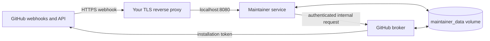

# OMP Maintainer

OMP Maintainer is a self-hosted GitHub App service for handling approved repository work with bounded publication rules. It receives selected GitHub events, prepares isolated workspaces, and can open constrained pull requests or add repository comments when the installed repository policy permits it.

It is designed for maintainers who want a local operational boundary: GitHub App credentials remain in a small broker service, while the maintainer service has only an authenticated connection to that broker. Start with one non-critical repository and the included strict policy.

> [!WARNING]
> This service can create branches, commits, pull requests, labels, and comments when policy permits. It does not merge by default, but an opened pull request or comment is still a publication. Read the policy and trust-boundary sections before installing the App.

## What it handles

| Area | Default bounded behavior |
| --- | --- |
| Issues | Handles opened and reopened issues. The supplied policy permits implementation only for `bug` and `documentation`; other implementation classes require an owner authorization. |
| Pull requests | Can inspect opened, reopened, and ready-for-review pull requests, and handle eligible follow-up comments. The supplied policy keeps comment-driven fixes off. |
| CI and releases | Workflow-run handling is present but release repair is off in the supplied policy and Compose defaults. It requires explicit service and repository-policy opt-in. |
| Publication | Commits use allowed branch prefixes only. Default-branch pushes, tag pushes, and merges are prohibited by the supplied policy. |

## Architecture and trust boundary



- **Maintainer service:** accepts signed webhooks, checks the repository allowlist, applies per-repository policy, runs work, and serves the local dashboard. It has no GitHub App private key or App ID.
- **GitHub broker:** is the only service with the GitHub App ID and private-key file. It obtains short-lived installation tokens and performs GitHub and Git operations on behalf of the maintainer service.
- **Service boundary:** the broker has no host port. Docker places the maintainer-to-broker channel on an internal network and authenticates it with `OMP_MAINTAINER_GH_PROXY_HMAC_KEY`.
- **Policy boundary:** the policy is read from `origin/<default-branch>:.github/omp-maintainer.yml`, never from a task branch. A malformed, unreadable, or unsupported policy disables mutations.
- **State boundary:** the named `maintainer_data` volume contains the SQLite database, logs, and workspace state. It is durable across ordinary container recreation and must be backed up before upgrades.

The service accepts only repositories named in `OMP_MAINTAINER_REPO_ALLOWLIST`. App installation scope and the allowlist are separate controls: install the App on selected repositories and list only the repositories that this instance may handle.

## Prerequisites

Before beginning, have:

1. Python 3.11 or newer and [`uv`](https://docs.astral.sh/uv/) for the one-time setup and preflight commands run from this source checkout.
2. Docker Engine with the Docker Compose plugin.
3. A GitHub account allowed to create a GitHub App and install it on the selected repository or organization.
4. An HTTPS endpoint that GitHub can reach. The bundled Compose configuration intentionally binds the dashboard and webhook receiver to `127.0.0.1` only, so use a TLS reverse proxy or equivalent ingress in front of it.
5. Outbound access from the containers to GitHub and to the selected OMP provider.
6. One OMP provider and model selection. Direct provider credentials are optional and are described in [Provider selection](#provider-selection-and-credential-scope).

Do not expose the broker service, its private-key file, or the Docker data volume through the public ingress.

## Create and install the GitHub App

Create one GitHub App for this deployment. Give it a descriptive name, generate a private key, and install it only on the repositories this instance will allowlist. Enable webhook delivery, keep SSL verification enabled, and use a long random webhook secret.

### Repository permissions

Request these repository permissions and no organization, account, or administration permissions:

| Permission | Access | Why it is needed |
| --- | --- | --- |
| Metadata | Read | Required GitHub App repository metadata. |
| Contents | Read and write | Clone selected repositories and publish permitted branches and commits. |
| Issues | Read and write | Read issue context and publish permitted comments, labels, assignments, or closure. |
| Pull requests | Read and write | Read diffs and conversation context, open pull requests, and publish permitted pull-request comments or reviews. |
| Actions | Read | Inspect workflow runs, jobs, and failed-job log tails for the optional CI and release path. |

The `Contents` permission is also required for GitHub App HTTP Git access. Do not grant Administration, Secrets, Variables, Deployments, Environments, Commit statuses, Checks, Workflows, or organization-wide permissions for this deployment.

### Webhook subscriptions

Subscribe to these repository events:

| GitHub event | Handled actions |
| --- | --- |
| Issues | `opened`, `reopened`, `closed` |
| Issue comment | `created` |
| Pull request | `opened`, `reopened`, `ready_for_review`, `closed` |
| Pull request review comment | `created` |
| Workflow run | `completed`, only when release handling is explicitly enabled |

The App may receive additional actions for a selected event. They are ignored unless explicitly handled. The policy and service configuration are checked again before work may publish anything.

## Configure and validate

`.env.example` is a field reference containing placeholders only. Keep the resulting `.env` outside version control and protect the private-key file with filesystem permissions appropriate to its host.

Run the initial commands from this source checkout. The examples use `uv run` so no global installation is required. The recommended setup command is non-destructive: it creates the requested environment file only when the path does not already exist and refuses to replace an existing file.

```sh
uv run omp-maintainer setup \
  --env-file .env \
  --github-app-id <GITHUB_APP_ID> \
  --github-app-private-key-path ./secrets/github-app-private-key.pem \
  --bot-login <GITHUB_APP_LOGIN> \
  --git-author-email <GIT_AUTHOR_EMAIL> \
  --repo OWNER/REPOSITORY \
  --model <OMP_MODEL> \
  --provider <OMP_PROVIDER>
```

Repeat `--repo OWNER/REPOSITORY` for each repository this instance may handle. `--model` and `--provider` are optional selection overrides. Setup writes the supplied non-secret configuration, records the private-key path without reading the key, and generates the webhook secret, broker HMAC key, and intervention token. Copy the generated `GITHUB_WEBHOOK_SECRET` from protected `.env` into the GitHub App configuration. The setup-created file is owner-only and contains no `REPLACE_WITH_...` values.

For a manual configuration instead, copy `.env.example` to a new `.env`, replace all required placeholders, and do **not** invoke `setup` against that existing file. The refusal to overwrite is intentional.

Doctor checks that the configured OMP executable is available. The supplied Docker image includes it, so run doctor from the running maintainer container after Compose starts. Doctor emits one machine-readable JSON object with configuration, broker, state, workspace, log, and OMP checks, and never prints secret values. Treat a failing doctor result as a configuration problem, not as a reason to loosen App permissions or disable policy safeguards.

## Start with Docker Compose

Build and start the two services:

```sh
docker compose --env-file .env up -d --build
docker compose --env-file .env ps
curl --fail http://127.0.0.1:8080/healthz
docker compose --env-file .env exec maintainer omp-maintainer doctor
```

The expected health response is `{"status":"ok"}`. `github-broker` must become healthy before `maintainer` starts. Use the following commands for local operational inspection:

When investigating a broker outage after the container starts, run the local-only variant. It skips only the broker request:

```sh
docker compose --env-file .env exec maintainer omp-maintainer doctor --offline
```

```sh
docker compose --env-file .env logs --tail=100 maintainer
docker compose --env-file .env logs --tail=100 github-broker
docker compose --env-file .env exec maintainer omp-maintainer status
```

Do not add a `ports` entry for `github-broker`. Only the maintainer service should be reachable from the ingress layer, and the supplied Compose file binds that service to loopback by default.

## Set the webhook URL

Point the GitHub App webhook URL at the HTTPS route terminated by your ingress:

```text
https://maintainer.example.com/webhook/github
```

Configure the App's webhook secret to the same value as `GITHUB_WEBHOOK_SECRET` in `.env`. The route must forward to `127.0.0.1:8080` on the host running Compose. Do not use a private address or `localhost` as the GitHub-facing URL, and do not route GitHub to port 8081.

After saving the App configuration, inspect its delivery page for a successful ping or a signed event. A `401` normally means the webhook secret is different at GitHub and in `.env`; a connection failure normally means the HTTPS ingress cannot reach the local receiver.

## Install the per-repository policy

Copy the included strict v1 policy into every repository that this instance is allowed to handle, commit it on that repository's default branch, and push it before relying on automation:

```sh
mkdir -p /path/to/your/repository/.github
cp examples/omp-maintainer.yml /path/to/your/repository/.github/omp-maintainer.yml
```

Replace `/path/to/your/repository` with the local checkout of an allowlisted repository. Review and commit the copied file in that repository. The service fetches policy only from the remote default-branch ref, so a policy added solely to an unpushed branch does not authorize a change.

The example is intentionally explicit:

- Issue implementation is limited to `bug` and `documentation`. `enhancement`, `proposal`, and `feature` require an `OWNER` authorization.
- Pull-request inspection is enabled, while comment-driven fixes and unlisted bot identities are disabled.
- Only `farm/` task branches and `review/pr-` review branches are allowed. Default-branch and tag pushes are prohibited.
- Release handling is disabled, and merging is disabled.
- The label vocabulary is allowlisted to prevent arbitrary label publication.

Policy documents are strict. Version values other than `1`, unknown keys, and loader metadata are rejected. A policy load error lets the service inspect and report state but disables mutations. Do not place secrets, provider keys, or private-key paths in policy files.

## Provider selection and credential scope

OMP Maintainer passes its selection to OMP as the pair `provider` plus `model`:

```dotenv
OMP_MAINTAINER_PROVIDER=<OMP_PROVIDER>
OMP_MAINTAINER_MODEL=<OMP_MODEL>
```

`OMP_MAINTAINER_MODEL` may be one model identifier or a comma-separated selection pool. `OMP_MAINTAINER_RELEASE_MODEL` can provide a separate release-only selection; otherwise release handling uses the normal model selection. Keep a provider compatible with every selected model.

You may use an OMP-supported authenticated provider route without placing a direct API key in `.env`. Direct credentials are optional. Compose can pass the following optional provider credentials to the maintainer service only:

- `ANTHROPIC_API_KEY` or `ANTHROPIC_OAUTH_TOKEN`
- `OPENAI_API_KEY` or `OPENAI_CODEX_OAUTH_TOKEN`
- `GEMINI_API_KEY`, `GROQ_API_KEY`, `OPENROUTER_API_KEY`, `MISTRAL_API_KEY`, `XAI_API_KEY`, `CEREBRAS_API_KEY`, `DEEPSEEK_API_KEY`, or `TOGETHER_API_KEY`
- `OPENAI_BASE_URL`, `OLLAMA_BASE_URL`, `LM_STUDIO_BASE_URL`, or `LLAMA_CPP_BASE_URL` when the selected provider uses a custom endpoint

A direct provider credential reaches OMP task subprocesses so they can authenticate. It does **not** reach the GitHub broker and cannot be used as a GitHub App credential. In return, every allowlisted repository and task surface is within the direct credential's trust boundary and may incur provider charges. Use the least-privileged provider account, set provider-side spending limits, and do not add direct credentials unless you accept that boundary.

### Budgets and concurrency

`OMP_MAINTAINER_TASK_MAX_COST_USD`, `OMP_MAINTAINER_TASK_MAX_TOKENS`, and `OMP_MAINTAINER_RELEASE_MAX_COST_USD` are local post-turn limits. The service checks cumulative usage after a turn completes, then prevents another turn after the threshold is reached.

They are not hard provider billing or token caps. A single in-flight turn can exceed the configured cost or token value before the service stops later turns. Concurrent tasks can each incur their own final-turn overshoot. Set `OMP_MAINTAINER_MAX_CONCURRENCY` conservatively and use provider-side billing caps as the actual financial stop boundary.

## Dashboard and intervention

Open the local dashboard at `http://127.0.0.1:8080/`. It shows delivery state, issue and release state, and logs stored in the durable volume. It is not an authentication boundary by itself, so keep it behind loopback or your authenticated administrative network.

Manual triage, retry, cancellation, and the issue picker require `OMP_MAINTAINER_REPLAY_TOKEN`. Leave that value unset to disable those mutation endpoints. When enabled, store the token as a secret and use the dashboard only from a trusted administrative session.

A running delivery can be cancelled from the dashboard. Cancellation stops the active OMP subprocess and records the delivery as failed. It does not undo a branch, commit, pull request, comment, label, or other publication that occurred before cancellation. Inspect remote state before retrying.

For a command-line manual triage of an allowlisted issue, use the running container:

```sh
docker compose --env-file .env exec maintainer \
  omp-maintainer triage OWNER/REPOSITORY#123
```

To pause incoming work while preserving durable state, stop the maintainer service. Start it again to resume the persisted queue:

```sh
docker compose --env-file .env stop maintainer
docker compose --env-file .env start maintainer
```

## Upgrade safely

1. Back up the named data volume as described below.
2. Read the target release notes and [UPSTREAM.md](UPSTREAM.md) before changing source or dependency versions.
3. Update the checked-out source to the chosen release or reviewed commit.
4. Rebuild and replace the services without removing volumes:

   ```sh
   docker compose --env-file .env up -d --build
   ```

5. Run `docker compose --env-file .env exec maintainer omp-maintainer doctor`.
6. Confirm `/healthz`, broker health, and the dashboard before allowing new work.

Do not use `docker compose down -v` for an ordinary upgrade. The `-v` option deletes named volumes, including the database, logs, and workspace state.

## Backup and restore

Back up while both services are stopped so the SQLite database and filesystem state are consistent. Resolve the actual Docker volume from the maintainer container instead of guessing Compose's project-scoped volume name.

```sh
mkdir -p backups
container="$(docker compose --env-file .env ps --all --quiet maintainer)"
volume="$(docker inspect --format '{{range .Mounts}}{{if eq .Destination "/data"}}{{.Name}}{{end}}{{end}}' "$container")"
test -n "$volume"
stamp="$(date -u +%Y%m%dT%H%M%SZ)"
docker compose --env-file .env stop
docker run --rm \
  -v "${volume}:/data:ro" \
  -v "$PWD/backups:/backup" \
  alpine tar -C /data -czf "/backup/omp-maintainer-data-${stamp}.tgz" .
docker compose --env-file .env up -d
```

Record the archive checksum and keep the archive in storage that is separate from the host. Test a restore before treating a backup as recoverable.

A restore overwrites all content in the resolved data volume. Verify the archive path and the resolved `volume` value before continuing, stop both services, and restore only when you have a current backup of the target state:

```sh
archive=backups/omp-maintainer-data-<TIMESTAMP>.tgz
archive="$(cd "$(dirname "$archive")" && pwd)/$(basename "$archive")"
container="$(docker compose --env-file .env ps --all --quiet maintainer)"
volume="$(docker inspect --format '{{range .Mounts}}{{if eq .Destination "/data"}}{{.Name}}{{end}}{{end}}' "$container")"
test -n "$volume"
tar -tzf "$archive" >/dev/null
docker compose --env-file .env stop
docker run --rm \
  -v "${volume}:/data" \
  -v "${archive}:/backup/restore.tgz:ro" \
  alpine sh -c 'find /data -mindepth 1 -maxdepth 1 -exec rm -rf -- {} + && tar -C /data -xzf /backup/restore.tgz'
docker compose --env-file .env up -d
docker compose --env-file .env exec maintainer omp-maintainer doctor
```

The restore command deliberately removes only the contents of the explicitly resolved `/data` volume before extraction. Do not substitute a broad host path for that mounted volume.

## Troubleshooting

| Symptom | Check |
| --- | --- |
| `doctor` fails after Compose starts | Run `docker compose --env-file .env exec maintainer omp-maintainer doctor --offline`; replace every required placeholder, verify readable private-key path, and ensure the allowlist uses exact `owner/repository` names. |
| GitHub reports a failed webhook delivery | Confirm the public HTTPS URL ends in `/webhook/github`, ingress reaches local port 8080, SSL verification is enabled, and the two webhook-secret values match. |
| A delivery is ignored | Confirm the App is installed on that repository, the repository is in `OMP_MAINTAINER_REPO_ALLOWLIST`, and the correct webhook event is selected. |
| A delivery is observed but no change is published | Inspect the repository's default-branch policy. An invalid policy fails closed; a valid policy can still disallow the issue class, branch, release path, or merge. |
| `github-broker` is unhealthy | Check the App ID, private-key file path, and broker logs. Keep the private key in the Compose secret mount only, never in the maintainer service environment. |
| Provider authentication fails | Verify the selected `provider` plus `model` pair and configure only the corresponding optional credential or endpoint. Do not paste credentials into issue text, policy files, logs, or command output. |
| Dashboard controls are unavailable | Set `OMP_MAINTAINER_REPLAY_TOKEN`, restart Compose, and access the dashboard from a trusted administrative network. Leave it unset when manual intervention is not required. |
| Spending exceeds a local task limit | Account for post-turn overshoot and concurrent work. Reduce concurrency and enforce a provider-side hard spend limit. |

## Security limits

This deployment deliberately limits, but cannot eliminate, risk:

- GitHub App credentials stay broker-only. Compose consumes `GITHUB_APP_ID` and the private-key path only to configure `github-broker`; never add the App ID or private key to the `maintainer` service environment.
- The broker's internal network is not a substitute for host security. Protect Docker access, `.env`, the private-key file, backups, logs, and the dashboard.
- Webhook signatures, App installation scope, repository allowlisting, and default-branch policy are separate controls. Keep all four.
- A policy can restrict publication paths, not make repository content trustworthy. Review policy changes as privileged repository changes.
- Direct provider credentials are optional and have a broader task-process trust boundary. GitHub App credentials never cross that boundary.
- Local usage limits are post-turn estimates, not hard billing caps. One turn can overshoot before work stops.
- Cancellation and restart are operational stops, not remote rollback. Published GitHub state requires human review and any required manual remediation.

## License and upstream provenance

OMP Maintainer is distributed under the [MIT License](LICENSE). It incorporates designated RoboOMP and Python RPC source from Oh My Pi at a recorded upstream commit. The preserved provenance, source mapping, license obligations, and synchronization procedure are in [UPSTREAM.md](UPSTREAM.md). Third-party notices remain in [THIRD_PARTY_NOTICES.md](THIRD_PARTY_NOTICES.md).
